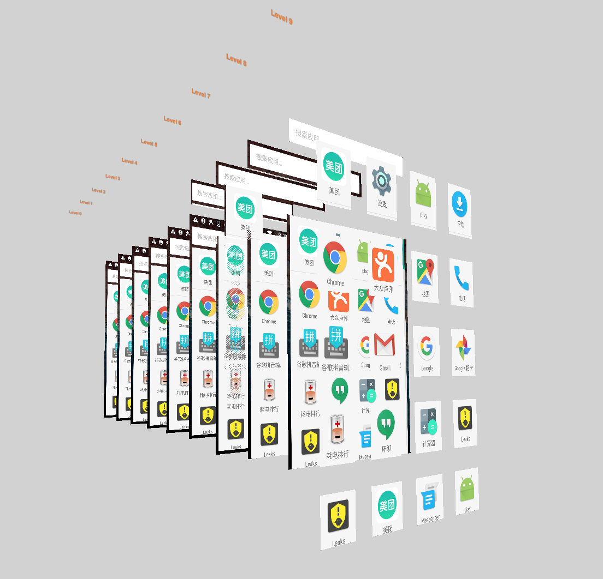

# ui_monitor
###An Android UI Monitor

An simple Android View Monitor.

Run bash script to get Screen capture and ViewTree info and display it in Browser.

Started a server linstening port 8081.

The Demo is []

by JavaScript.

Nodejs, Express and Three.js.

 
